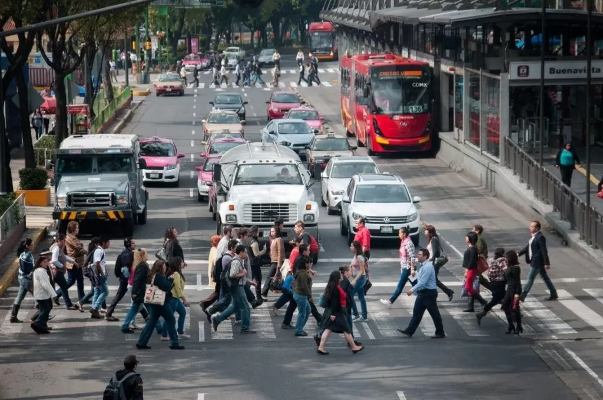
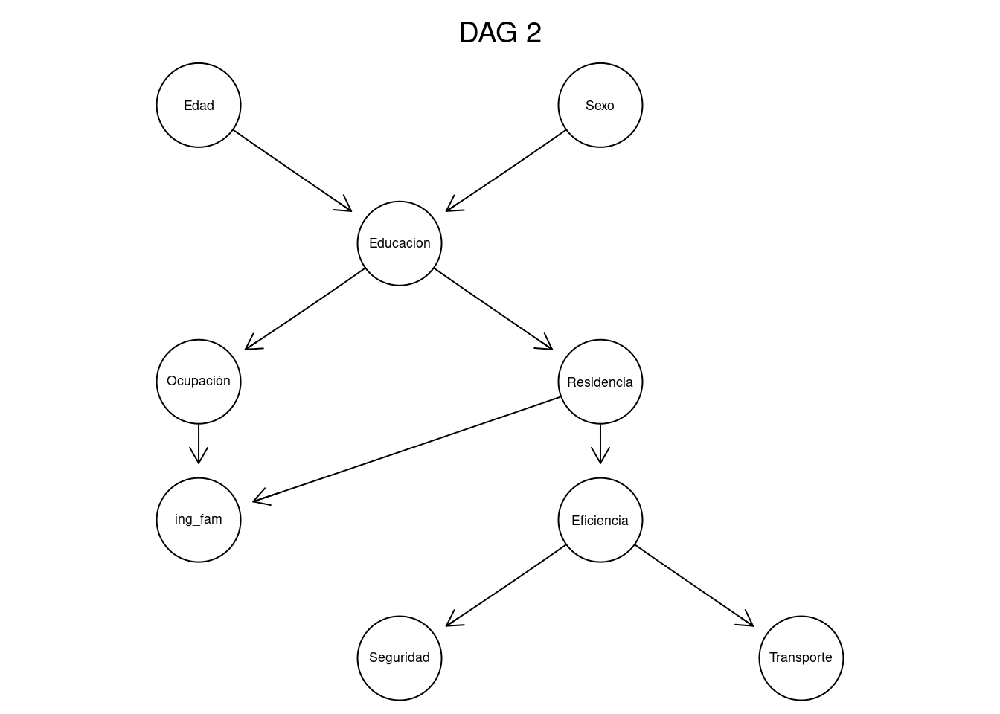
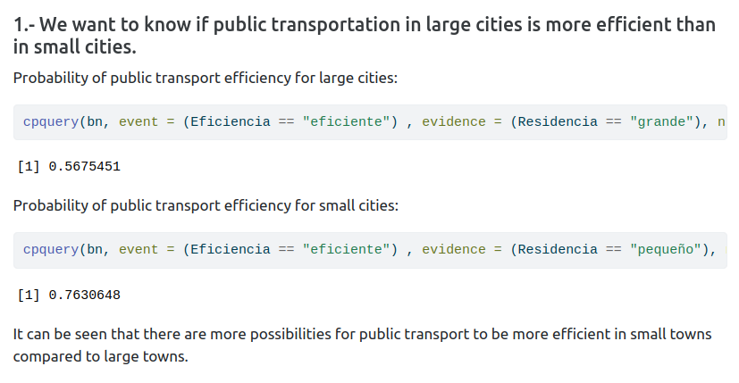
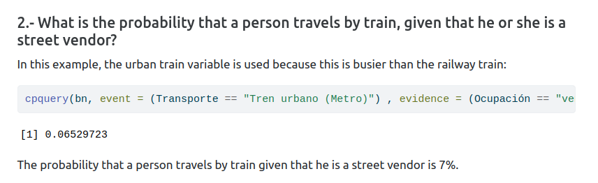
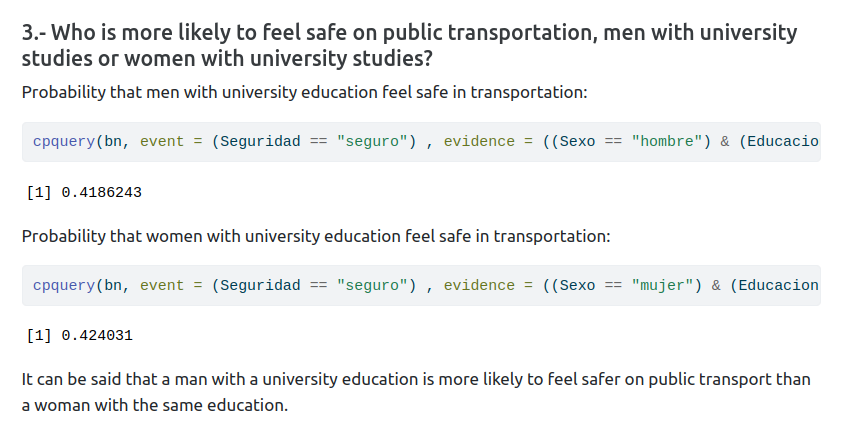

# Transportation Analysis in Mexico with Bayesian Networks

This project used data from the [National Mobility and Transportation Survey](http://www.losmexicanos.unam.mx/movilidadytransporte/encuesta_nacional.html) conducted by [The Institute of Legal Research at UNAM](https://www.juridicas.unam.mx/) with the objective of gathering information on the modes of transportation used in Mexico 🇲🇽, as well as the efficiency and safety of public transportation, in order to have evidence that assists in the development of public policies related to urban development.

*Mobility and Transportation Projects in Mexico City.* [^1]

__Authors__: [Alejandra Velaco](https://github.com/Aleevz), [Manuel Solano](https://github.com/manuelsolan-o), [José Carlos Yamuni](https://github.com/josecyamuni), [Antonio Juaréz](https://github.com/JAJP2203), [Mayra de Luna](https://github.com/mayradlu)

## Building a Bayesian network 
Three DAGs (Directed Acyclic Graphs) are proposed to represent the dependency relations among variables.

*Second DAG propoused*

## Queries

We can answer queries in order to know the probability of specific events

## Conclusions

This study showcases the effectiveness and utility of Bayesian Networks as an analytical tool for addressing questions and investigating hypotheses in diverse contexts. By capturing the probabilistic dependencies among variables, these networks offer a rigorous means of assessing the impact of changes in one variable on others, as well as estimating the probability of future events based on current observations.

##
[^1]: Herrera, D. (2019a, octubre 21). Proyectos de Movilidad y Transporte en la CDMX. https://inmobiliare.com/proyectos-de-movilidad-y-transporte-en-la-cdmx/.
